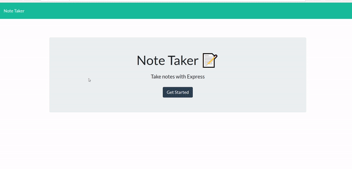

# Note-taker
The Note-taker application is an application that allows a user to write, save and delete notes. It works using server-side code to dynamically update a list of notes based on how the user interacts with the site. The site can be found here: [Note Taker](https://morning-shelf-65981.herokuapp.com/). 

## Installation
The site can be run on any modern browser.

## Usage
Upon arriving at the site, the user can click on the "Get Started" button at the center of the page to begin writing his/her notes. When this button is clicked, the user is taken to another page that dynamically displays the saved notes the user last entered, if they exist. The user then has the option to enter text into the "Note title" and "Note text" fields, after which he/she can click on the save button in the top-right corner to save the note. The note is then displayed along with other saved notes in the left sidebar. The user can also delete any saved note by clicking the delete button on the saved note.

## Demonstration
A demonstration of the application can be seen here: .
